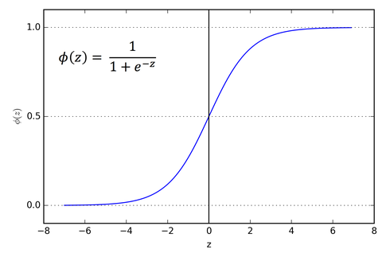
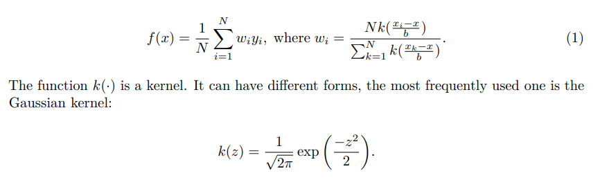

# The-Hundred-Page-Machine-Learning-Book-Summary
My notes on The Hundred-Page Machine Learning Book

Machine learning is a universially recognized term that usually refers to the science and engineering of building machines capable of doing various useful things without being explicitly programmed to do so.

# Topics to discover later

1) PAC Learning

2) Conditional Random Fields

3) Siamese Neural Network

4) Analysis of Algorithms

5) Python Generators

6) Prediction Strength in Clustering

7) Sorting algorithms

# Section 1

1) In outlier detection, the output is a real number that indicates how xis different from a typical example in the dataset.

2) Machines are good at optimizing functions under constraints.

3) In SVM, the margin is the distance between the closest examples of two classes, as defined by the decision boundary. A large margin contributes to a better generalization.

# Section 2

1) A vector multipled by a scalar is a vector. A dot-product of two vectors is a scalar. The multiplication of a matrix W by a vector gives another vector as a result.

2) A derivative f' of a function f is a function or a value that describes how fast f grows(or decreases).

3) Gradient is the generalization of derivative for functions that take several inputs. A gradient of a function is a vector of partial derivatives.

4) A random variable is a variable whose possible values are numerical outcomes of a random phenomenon. There are two types of random variables: discrete and continuous.

5) Bayes' Rule:

6) KNN is an instance based ML algorithm which uses the whole dataset. SVM and most of outher ML algorithms are model-based learning algorithms.

# Section 3

1) The form of our linear model in equation 1 is very similar to the form of SVM model. The only difference is the missing operator. The two models are indeed similar. However, the hyperplane in the SVM plays the role of the decision boundary: it is used to separated two groups of examples from one another. As such, it has to be as far from each group as possible.

2) Linear regression might be useful because it doesn't overfit much.

3) In 1705, the French mathematician Adrien-Marie Legendre, who first published the sum of squares method for gauging the quality of the model stated that squaring the error before summing is convenient. Why did he say that? The absolute value isn't convenient, because it doesn't have a continuous derivative, which makes the function not smooth. Function that aren't smooth create unnecessary difficulties when employing linear algebra to find closed form solutions to optimization prblems. Closed form solutions to finding an optimum of a function are simple algebraic expressions and are often preferrable to using complex numerical optimization methods, such as gradient descent.

4) Intiutively, squared penalties are also advantageous because they exaggerate the difference between the true target and the predicted one according to the value of this difference. We might also use the powers of 3 or 4, but their derivatives are more complicated to work with.

5) Finally, why do we care about the derivative of the average loss? Remember from algebra that if we can calculate the gradient of the function in eq. 2, we can then set this gradient to zero and find the solution to a system of equations that gives us the optimal values w and b (To find the minimum or the maximum of a function, we set the gradient to 0 because the value of the gradient at extrema of a function is always zero. In 2D, the gradient at an extremum is a horizontal line)

6) When computers were absent, scientists made the calculations manually and they want to find a linear classification model. They look for a simple continuous function whose codomain (the values it can output) is between 0 and 1. One function having this property is sigmoid function.

7) In linear regression, we minimized **MSE**. The optimization criterion in logistic regression is called *Maximum Likelihood*. Instead of minimizing the average loss like in linear regression, we now maximize the likelihood of the training data according to our model. In practice, it is more convenient to maximize the sum of log-likelihood instead of likelihood because the product of likelihood lead to numerical overflow and the sum of log-likelihood doesn't lead to numerical overflow. The log-likelihood instead of likelihood. The log-likelihood is defined like follows:

8) Contrary to linear regression, there is no closed form solution to the above optimization problem. A typical numerical optimization procedure used in such cases is *gradient descent*.

9) In ID3 tree based model, the goodness of a split is estimated by using the criterion called entropy. In ID3, at each step, at each leaf node, we find a split that minimizes the entropy giiven by equation 7. In ID3, the decision to split the dataset on each iteration is local(doesn' depend on future splits).

10) To extend SVM to cases in which the data isn't linearly separable, we introduce the hinge loss function. C is a hyperparameter determining the tradeoff between increasing the size of the decision boundary and ensuring that each xi lies on the correct side of the decision boundary.

11) In SVM, there are multiple kernel functions and the most widely used one is RBF kernel.

12) KNN is a non-parametric learning algorithm. Contrary to other learning algorithms that allow discarding the training data after the model is built, kNN keeps all training examples in memory.

# Section 4

1) Gradient Descent is an iterative optimization algorithm for finding the minimum of a function. To find a local minimum of a function using gradient descent, one starts at some random point and takes steps proportiona to the negative of the gradient(or approximate gradient) of the function at the current point.

2) Gradient descent can be used to find optimal parameters for linear and logistic regression, SVM and also neural network which we consider later. For many models, such as logistic regression or SVM, the optimization criterion is convex. Convec functions have only one minimum, which is global. Optimization criteria for NN's aren't convex, but in practice even finding a local minimum suffices.

3) A learning algorithm consists of 3 parts:
    - A loss function
    - An optimization criterion based on the loss function
    - An optimization routine

4) Linear regression has a closed form solution. That means that gradient descent isn't needed to solve this specific type of problem.

5) In complex models, the initialization of parameters may significantly affect the solutipn found using gradient descent.

6) Gradient descent and its variants aren't ML algorithms. They are solvers of minimization problems in which the function to minimize has a gradient in most points of its domain.

7)Some classification models, like SVM and KNN, given a feature vector only output the class. Others like logistic regression or decision trees, can also return the score between 0 and 1.

# Section 5

1) In some cases, a carefully designed binning can help the learning algorithm to learn using fewer examples. I t happens because we give a "hint" to the learning algorithm that if the value of a feature falls within a specific range, the exact value of the feature doesn't matter.

2) Normalizating the data isn't a strict requirement. However, in practice, Normalization can lead to an increased speed of learning. If x1 is in range [0,1000] and x2 the range [0,0.001], then the derivative with respect to a larger feature will dominate the update.

3) z-score is calculated as follows:

4) Normalization vs Standardization 

    - Unsupervised learning algorithms more often benefit from standardization rather than normalization

    - Standardization is preferred for data having bell-shaped curve.

    - Standardization is more useful for data having extreme values because normalization will squeeze the normal values into a very small range.

    - For other cases, normalization is more preferrable

5) Modern implementations of the learning algorithms, which you can find in popular libraries,are robust to features lying in different ranges. Feature rescaling is usually beneficial to most learning algorithms, but in many cases, the model will still be good when trained from the original features.

6) Regularization is an umbrella-term that encompasses methods that force the learning algorithm to build a less complex model.

7) L1 and L2 formulas

8) L1 regularization produces a sparse model, a model that has most of its parameters(in case of linear models, most of w) equal to zero(provided the hyperparameter C is large enough). So L1 makes feature selection by deciding which features are essential for prediction and which aren't. That can be useful in case you want to increase model explainability.

9) However, your goal is to maximize the performance of the model on the hold-out data, then L2 usually gives better results. L2 also has the advantage of being differentiable, so gradient descent can be used for optimizing the objective function.

10) SVM accepts weightings of classes as input.

11) ROC stands for "Receiver Operating Characteristic", the term comes from radar engineering.

# Section 6

1) The RELU  activation function suffers much less from the problem of vanishing gradient.

2) In practice, many business problems can be solved with neural networks having 2-3 layers between the input and output layers.

3) ou may have noticed that in images, pixels that are close to one another usually represent the same type of information: sky, water, leaves, fur, bricks and so on. The exception from the rule are the edges: the parts of an image where two different objects "touch" one another.

4) We can then train multiple smaller regression models at once, each small regression model receiving a square patch as input. The goal of each small regression model is to learn to detect a specific kind of pattern in the input patch.

5) To detect some pattern, a small regression model has to learn the parameters of a matrix F (for "filter") of size p xp, where p is the size of a patch.

# Section 7

1) Kernel regression is a non-parametric method. That means that here are no parameters to learn.

2) SVM cannot be naturally extented to multiclass problems. Some algorithms can be implemented more efficiently in the binary case.

3) One-class classification learning algorithms are used for outlier detection, anomaly detection, and novelty detection. A typical one-class classification problem is the classification of the traffic in a secure network as normal.

4) There are several one-class learning algorithms: The most widely used in practice are one-class Gaussian, one-class kmeans, one-class kNN and one-class SVM.

5) The idea behind the one-class gaussian is that we model our data as if it came from a Gaussian Distribution, more precisely Multivariate Normal Distribution (MND); where the output of the function below returns the probability density corresponding to the input feature vector x. Probability density can be interpreted as the likelihood that example x was drawn from the probability distribution we model as an MND.  Values µ (a vector) and  (a matrix) are the parameters we have to learn.

6) In multi-label classification, we can transform each labeled example into several labeled examples, one per label. These new examples all have the same feature vector and only one label. That becomes a multiclass classification problem and can be solved via One Over Rest strategy. For this case, we have to determine the threshold and an input may be labeled as many targets. The threshold is chosen using the validation data.

7) For multilabel classification problem having small label count, we can create a fake class for each combination of the original classes. An example is below:

8) In Vanilla Bagging, only rows are subsetted. In Random forest, input variables are also subsetted.

9) Why it is called Gradient Boosting? In gradient boosting, we don't calculate any gradient contrary to linear regression. Instead of getting the gradient directly, we use its proxy in the form of residuals: they show us how the model has to be adjusted so that the error (residual) is reduced.

10) Most important hyperparameters to tune in gradient boosting: Number of trees, learning rate, the depth of tree

11) Boosting aims to reduce bias(underfitting), Random Forest aims to reduce variance(overfitting). As such, boosting can overfit.

12) Gradient Boosting for Binary Classification

13) Active Learning is that we start the learning with relatively few labeled examples, and a large number of unlabeled ones, and then add labels only to those examples that contribute the most to the model quality. For each unlabeled example x, the following importance score is computed: density(x) . uncertainty(x). Density reflects how many examples surround x in its close neighborhood, while uncertainty(x) reflects how uncertain the prediction of the model f is for x. Density for the example x can be obtained by taking the average of the distance from x to each of its k nearest neighbors(with k being a hyperparameter). Once we know the importance score of each unlabeled example, we pick the one with highest importance score and ask the expert to annotate it.

14) The supprot vector based active learning strategy consists in building an SVM model using the labeled data. We then ask our expert to annotate the unlabeled example that lies the closest to the hyperplane that separates the two classes. The idea is that if the example lies closest to the hyperplane, then it is the least certain and would contribute the most to the reduction of possible places where the true hyperplane could lie.

15) In self learning, we use a learning algorithm to build the initial model using the labeled examples. Then we apply the model to all unlabeled examples and label them using the model. If the confidence score of prediction for some unlabeled example x is higher than some threshold(chosen experimentally), then we add this labeled example to our training set, retrain the model and continue like this until a stopping criterion is satisfied.

16)In one-shot learning, typically applied in face recognition, we want to build a model that recogniz that two photos of the same person represent that same person. One way to build such a model is to train a siamese neural network. It is a common misconception that for one-shot learning, we need only one example of each entity for training. In practice, we need much more than one example of each person for the person identification model to be accurate.

# Section 8

1) There two popular algorithms that oversample the minortiy class by creating synthetic examples: SMOTE & ADASYN.

2) Decision trees, as well as Random Forest and Gradient Boosting, often outperform well on imbalanced datasets.

3) With neural networks, you have more flexibility. You can build two subnetworks, one for each type of input.

4) The subfield of computer science called analysis of algorithms is concerned with determining and comparing the complexity of algorithms.

5) When the complexity of an algorithm is measured in the worst case, the big O notation is used.

6) Usually, an algorithm is called efficient when its complexity in big O notation is polynomial in the size of the input. Therefore, both O(N) and O(N^2) are efficient. However, for every large inputs an O(N^2) algorithm can still be very slow. In the big era, scientists often look for O(logN) algorithms.

7) Use appropriate data structures. If the order of elements in a collection doesn't matter, use Set instead of list.

8) Python dictionary is called hashmap in other languages.

9) If you need to iterate over a vast collection ofelements, use generators that create a function that returns one element at a time rather than all the elements at once.

10) cProfile is a python package to find inefficiencies in your code.

11) Density estimation is a problem of modeling the pdf of the unknown probability distribution from which the dataset has been drawn. It can be useful for many applications, in particular for novelty or intrusion detection.

12) Prediction strength is a useful method of determining the reasonable number of clusters based on the concept of prediction strength.

13) Experiments suggest that a reasonable number of clusters is the largest k such that ps(k) is above 0.8

14) Gaussian Mixture Model allow each subsample to be a member of several clusters with different membership score. COmputing a GMM is very similar to doing model-based density estimation. In GMM, instead of having just one multivariate normal distribution(MND), we have a weighted sum of several MNDs.

15) UMAP and t-SNE are dimensionality reduction techniques.

16) Outlier detection can be solved via autoencoder and one-class learning. If we use autoencoder, we train it on our dataset. Then, if we want to predict whether an example is an outlier, we can use the autoencoder model to reconstruct the example from the bottleneck layer. The model will unlikely be capable of reconstructing an outlier.

17) In one-class classification, the model either predict that the input example the class, or it is an outlier.

# Section 10

1) Learning to rank is a supervised learning problem. Among others, one frequent problem solved using learning to rank is the optimization of search results returned by a search engine for a query. The goal of the learning is to find a ranking function f which outputs values that can be used to rank documents.

2) The state of the art rank learning algorithms, such as LambdaMART, implement the listwise approach. One popular metrix that combines both precision and recall is called Mean Average Precision (MAP).

3) Optimizing a metric is what we really want, but what we do in a typical supervised learning algorithm is we optimize the cost instead of the metric. Usually in supervised learning, as soon as we have found a model that optimizes the cost function, we try to tweak hyperparameters to improve the value of the metric. LambdaMART optimizes the metric directly.

4) Collaborative filtering has a significant advantage over content-based filtering: the recommendation to one user are computed based on what other users comsume or rate.

5) In collaborative filtering, the information on user preferences is organized in a matrix. Each row coreresponds to a user, and each column corresponds to a piece of content that user rated or consumed.

5) Most real-world recommender systems use a hybrid approach: they combine recommendations obtained by the content-based and collaborative-filtering models.

6) Two effective collaborative-filtering learning algorithms are factorization machines (FM) and denoising autoencoders. Another effective collaborative-filtering model is a feed-forward neural network with two inputs ando ne output. A training example is (u, m ,r). The input vector u is a one-hot-encoding of a user. The input vector m is a one-hot encoding of a movie. The output layer could be either a sigmoid(in which case the label r is in [0,1]) or RELU, in which case r can be in some typical range, [1,5] for example.

7) Word embeddings are an example of self supervised learning. The labeled examples get extracted from the unlabeled data such as text.

# Section 11

1) Generalized Linear Model is a generalization of the linear regression to modeling various forms of dependency between the input feature vector and the target. Logistic regression, for instance, is one form of GLMs. If you are interested in regression and you look for simple and explainable models, you should definitely read more on GLM.

