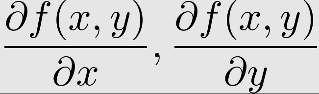

# The-Hundred-Page-Machine-Learning-Book-Summary
My notes on The Hundred-Page Machine Learning Book

Machine learning is a universially recognized term that usually refers to the science and engineering of building machines capable of doing various useful things without being explicitly programmed to do so.

# Topics to discover later

1) PAC Learning

# Section 1

1) In outlier detection, the output is a real number that indicates how xis different from a typical example in the dataset.

2) Machines are good at optimizing functions under constraints.

3) In SVM, the margin is the distance between the closest examples of two classes, as defined by the decision boundary. A large margin contributes to a better generalization.

# Section 2

1) A vector multipled by a scalar is a vector. A dot-product of two vectors is a scalar. The multiplication of a matrix W by a vector gives another vector as a result.

2) A derivative f' of a function f is a function or a value that describes how fast f grows(or decreases).

3) Gradient is the generalization of derivative for functions that take several inputs. A gradient of a function is a vector of partial derivatives.

4) A random variable is a variable whose possible values are numerical outcomes of a random phenomenon. There are two types of random variables: discrete and continuous.

5) Bayes' Rule:

6) KNN is an instance based ML algorithm which uses the whole dataset. SVM and most of outher ML algorithms are model-based learning algorithms.

# Section 3

1) The form of our linear model in equation 1 is very similar to the form of SVM model. The only difference is the missing operator. The two models are indeed similar. However, the hyperplane in the SVM plays the role of the decision boundary: it is used to separated two groups of examples from one another. As such, it has to be as far from each group as possible.

2) Linear regression might be useful because it doesn't overfit much.

3) In 1705, the French mathematician Adrien-Marie Legendre, who first published the sum of squares method for gauging the quality of the model stated that squaring the error before summing is convenient. Why did he say that? The absolute value isn't convenient, because it doesn't have a continuous derivative, which makes the function not smooth. Function that aren't smooth create unnecessary difficulties when employing linear algebra to find closed form solutions to optimization prblems. Closed form solutions to finding an optimum of a function are simple algebraic expressions and are often preferrable to using complex numerical optimization methods, such as gradient descent.

4) Intiutively, squared penalties are also advantageous because they exaggerate the difference between the true target and the predicted one according to the value of this difference. We might also use the powers of 3 or 4, but their derivatives are more complicated to work with.

5) Finally, why do we care about the derivative of the average loss? Remember from algebra that if we can calculate the gradient of the function in eq. 2, we can then set this gradient to zero and find the solution to a system of equations that gives us the optimal values w and b (To find the minimum or the maximum of a function, we set the gradient to 0 because the value of the gradient at extrema of a function is always zero. In 2D, the gradient at an extremum is a horizontal line)

6) When computers were absent, scientists made the calculations manually and they want to find a linear classification model. They look for a simple continuous function whose codomain (the values it can output) is between 0 and 1. One function having this property is sigmoid function.

7) In linear regression, we minimized *MSE*. The optimization criterion in logistic regression is called *Maximum Likelihood*. Instead of minimizing the average loss like in linear regression, we now maximize the likelihood of the training data according to our model. In ppractice, it is more convenient to maximize the log-likelihood instead of likelihood. The log-likelihood instead of likelihood.. The log-likelihood is defined like follows:

8) Contrary to linear regression, there is no closed form solution to the above optimization problem. A typical numerical optimization procedure used in such cases is *gradient descent*.

9) In ID3 tree based model, the goodness of a split is estimated by using the criterion called entropy. In ID3, at each step, at each leaf node, we find a split that minimizes the entropy giiven by equation 7. In ID3, the decision to split the dataset on each iteration is local(doesn' depend on future splits).

10) To extend SVM to cases in which the data isn't linearly separable, we introduce the hinge loss function. C is a hyperparameter determining the tradeoff between increasing the size of the decision boundary and ensuring that each xi lies on the correct side of the decision boundary.

11) In SVM, there are multiple kernel functions and the most widely used one is RBF kernel.

12) KNN is a non-parametric learning algorithm. Contrary to other learning algorithms that allow discarding the training data after the model is built, kNN keeps all training examples in memory.

